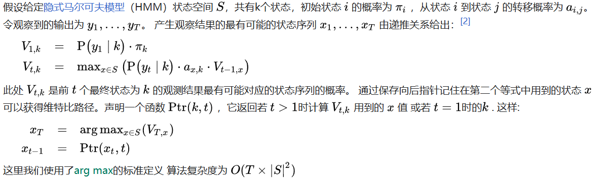
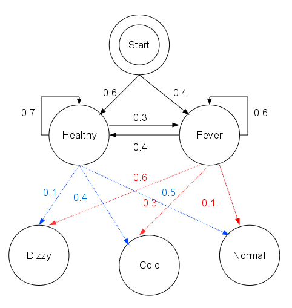
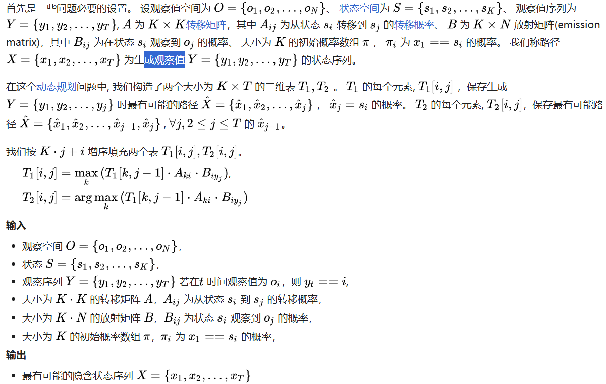

## HMM三要素

HMM是一个生成模型, 描述了两个相关序列的依赖关系 (状态序列A, 和观测序列O). 其中状态序列在t时刻的值
之和t-1时刻状态序列的取值有关, 观测序列在t时刻的值只和t时刻观测序列的取值有关.  

**HMM 三大假设**
1. 马尔科夫性假设: t时刻的状态出现的概率之和t-1时刻的状态有关.
2. 齐次性假设: 可以理解为时间平移不变性
3. 观测独立性假设: 某个时刻t的观测值值只依赖于该时刻的状态值, 与任何其他时刻的观测值和状态值无关.


**算法**




**Example**  
想像一个乡村诊所, 村民有着非常理想化的特性，要么健康要么发烧. 他们只有问诊所的医生的才能知道是否发烧。 聪明的医生通过询问病人的**感觉(观察)**诊断他们是否发烧。
村民只回答他们感觉**正常、头晕或冷**.

假设一个病人每天来到诊所并告诉医生他的感觉。医生相信病人的健康状况如同一个离散马尔可夫链。
病人的状态有两种“健康”和“发烧”，但医生不能直接观察到，这意味着状态对他是“隐含”的。
每天病人会告诉医生自己有以下几种由他的健康状态决定的感觉的一种：正常、冷或头晕。这些是观察结果。 整个系统为一个隐马尔可夫模型(HMM)。

医生知道村民的总体健康状况, 还知道发烧和没发烧的病人通常会抱怨什么症状. 换句话说, 医生知道隐马尔可夫模型的参数. 这可以用python表示
```python
states = ('Healthy', 'Fever')
 
observations = ('normal', 'cold', 'dizzy')
 
start_probability = {'Healthy': 0.6, 'Fever': 0.4}
 
transition_probability = {
   'Healthy' : {'Healthy': 0.7, 'Fever': 0.3},
   'Fever' : {'Healthy': 0.4, 'Fever': 0.6},
   }
 
emission_probability = {
   'Healthy' : {'normal': 0.5, 'cold': 0.4, 'dizzy': 0.1},
   'Fever' : {'normal': 0.1, 'cold': 0.3, 'dizzy': 0.6},
   }
```

这段代码中, 起始概率`start_probability`, 表示病人第一次到访时医生认为其所处的HMM状态, 他唯一知道的是病人倾向于是健康的. 这里用到的特定概率分布
不是君和的, 如转移概率大约是`{"Healthy": 0.57, "Fever": 0.43}`. 转移概率`transition_probability`表示潜在的马尔科夫链中健康状态的变化. 
这个例子中, 当天健康的病人仅有30%的机会第二天会发烧. 放射概率`emission_probability`表示每天病人感觉的可能性. 假如他是健康的, 50%会感觉正常.
如果他发烧了, 有60%的可能感觉到头晕.




病人连续三天看医生, 医生发现第一天他感觉正常, 第二天感觉冷, 第三天感觉头晕. 于是医生产生了一个问题: 怎样的健康状态训练最能够解释这些观察结果. 
维特比算法解答了这个问题.

```python
def viterbi(obs, states, start_p, trans_p, emit_p):
    V = [{}]
    path = {}

    # Initialize
    for st in states:
        V[0][st] = start_p[st] * emit_p[st][obs[0]]
        path[st] = [st]

    # Run Viterbi when t > 0
    for t in range(1,len(obs)):
        V.append({})
        newpath = {}

        for curr_st in states:
            paths_to_curr_st = []
            for prev_st in states:
                paths_to_curr_st.append((V[t-1][prev_st] * trans_p[prev_st][curr_st] * emit_p[curr_st][obs[t]], prev_st))
            curr_prob, prev_state = max(paths_to_curr_st)
            V[t][curr_st] = curr_prob
            newpath[curr_st] = path[prev_state] + [curr_st]

        # No need to keep the old paths
        path = newpath

    for line in dptable(V, states):
        print(line)
    prob, end_state = max([(V[-1][st], st) for st in states])
    return prob, path[end_state]

def dptable(V, states):
    # Print a table of steps from dictionary
    yield ' ' * 4 + '    '.join(states)
    for t in range(len(V)):
        yield '{}   '.format(t) + '    '.join(['{:.4f}'.format(V[t][state]) for state in V[0]])

def example():
    return viterbi(observations,
                   states,
                   start_probability,
                   transition_probability,
                   emission_probability)
print(example())
```

函数viterbi 具有以下参数: `obs` 为观察结果序列, 例如 `['normal', 'cold', 'dizzy']`； states 为一组隐含状态； start_p 为起始状态概率; 
trans_p 为转移概率; 而 emit_p 为放射概率。 为了简化代码，我们假设观察序列 obs 非空且 `trans_p[i][j]` 和 `emit_p[i][j]` 对所有状态 i,j 有定义。

维特比算法揭示了观察结果 ['normal', 'cold', 'dizzy'] 最有可能由状态序列 ['Healthy', 'Healthy', 'Fever']产生。 
换句话说，对于观察到的活动, 病人第一天感到正常，第二天感到冷时都是健康的，而第三天发烧了。

维特比算法的计算过程可以直观地由格图表示。 维特比路径本质上是穿过格式结构的最长路径。 诊所例子的格式结构如下, 黑色加粗的是维特比路径：


**伪代码**




## Refs
- [维特比算法](https://zh.wikipedia.org/wiki/%E7%BB%B4%E7%89%B9%E6%AF%94%E7%AE%97%E6%B3%95)
- 