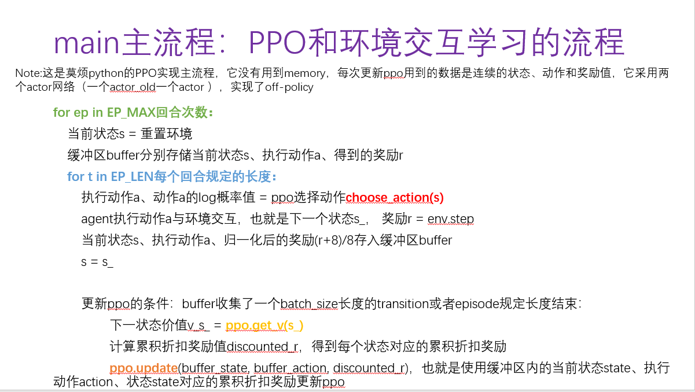
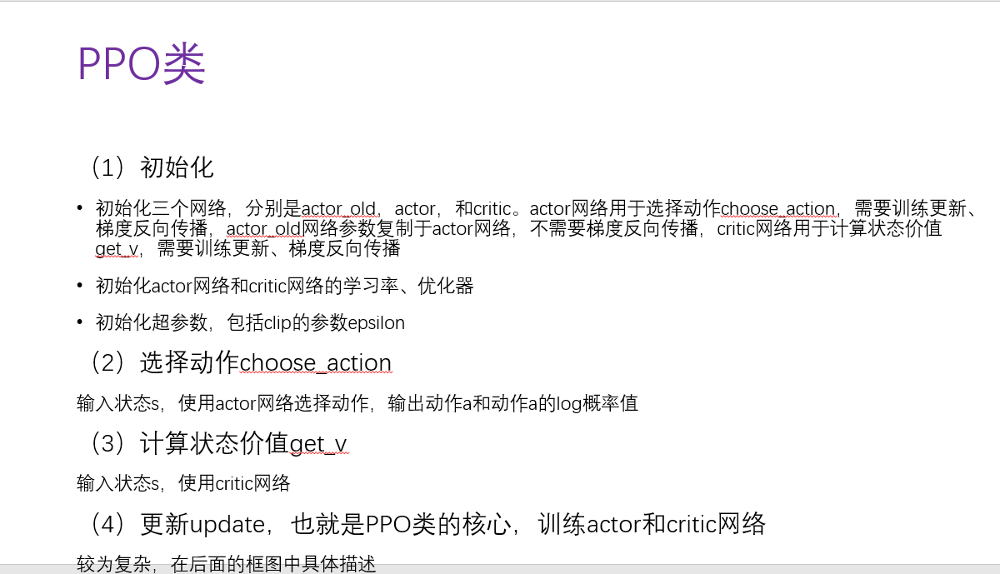
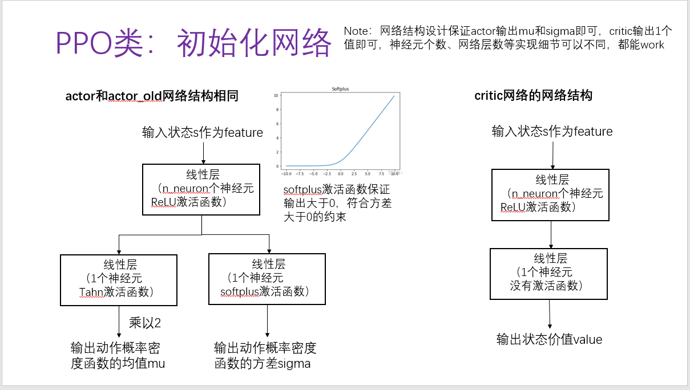
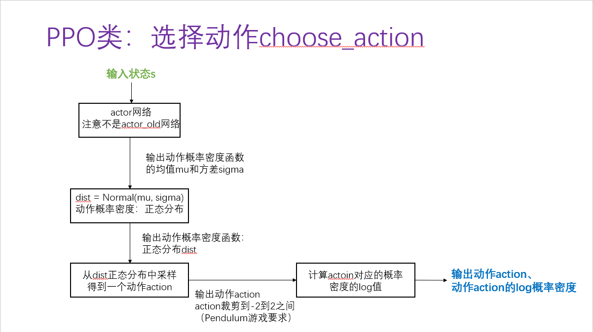
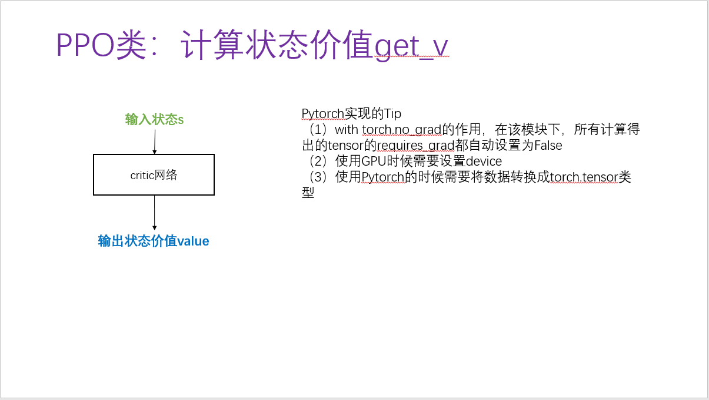
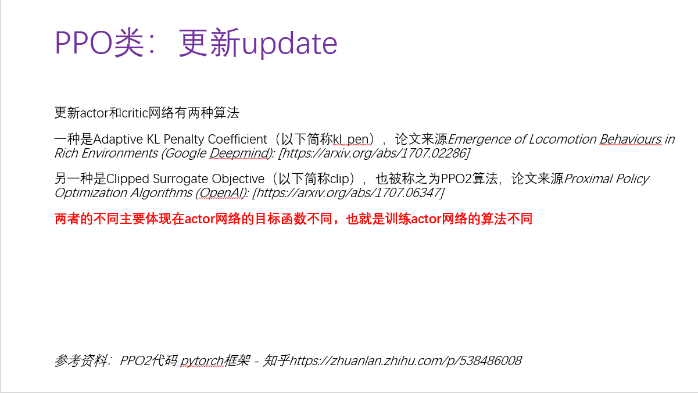
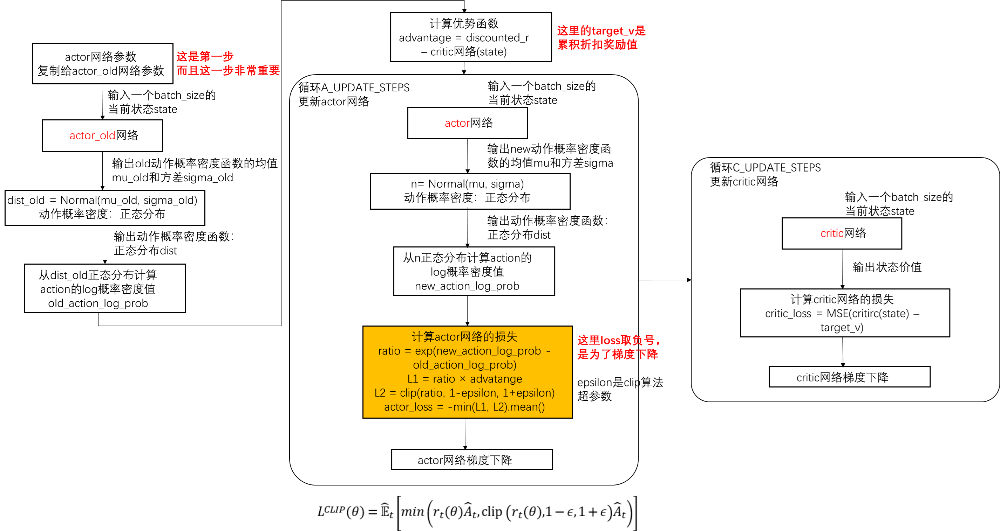
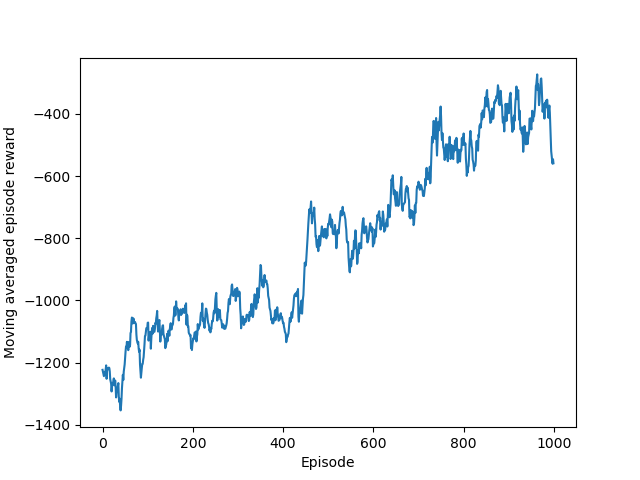

## 算法流程图
> blog: https://blog.csdn.net/ningmengzhihe/article/details/131459848

下面的算法流程图是基于莫烦python的PPO算法代码实现，同时参考了网络代码的算法流程，它没有用到memory，每次更新ppo用到的数据是连续的transition（包括当前状态、执行动作和累积折扣奖励值），它采用两个actor网络（一个actor_old一个actor ）

**Main Flow**

### PPO Class

**PPO Class**

**Init for PPO Class**

**PPO Class for choose action**

**PPO Class for get value**

计算状态的价值

**PPO for Update**
> 更新/训练网络的update

**Summary**
>　KL penalty和clip算法体现在更新actor网络方式不同, 也就是下面流程图中的黄色框

**Result**
> 在Pendulum-v1环境下的训练结果 

