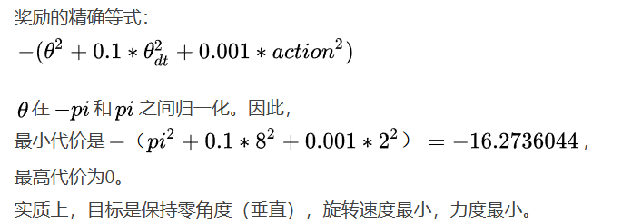

## 概述
倒立摆问题是控制中的经典问题, 这个版本问题中, 钟摆以随机位置开始, 目标是将其向上摆动, 使其保持直立.

类型: 连续控制.

### 环境
**Observation & state**

State 是最原始的环境内部的表示, observation则是state的函数. 好比所看见的东西并不一定就是它们在世界中的真实状态, 而是经过大脑加工过的信息.
thetadot是摆杆的角速度, theta是摆杆的角度, 两者都是连续的取值范围为[-8, 8].

**Actions**

Action 是一个连续的动作空间, 代表的是摆杆的力矩, 取值范围为[-2, 2].

**Reward**

**初始状态**

从-pi和pi的随机角度, 以及-1和1之间的随机速度开始.