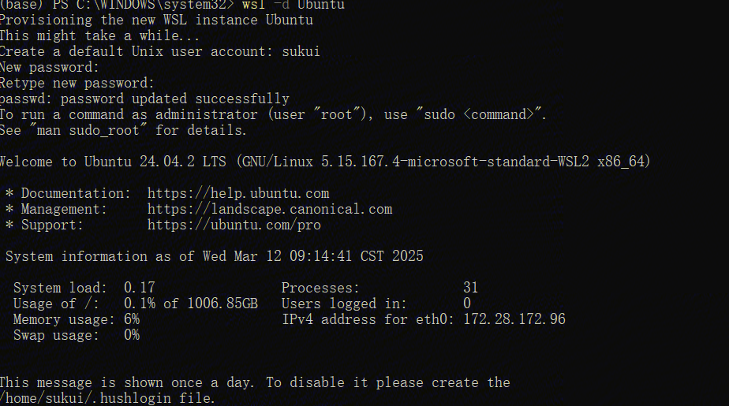

## WSL(Windows Subsystem for Linux) introduce




Information
```markdown
account: sukui
passwd: xxxxxxxxx

```

## Install DL Environment

open 控制面板->程序和功能->适用于Linux的Windows子系统-虚拟平台-Hyper-V->确定


```bash
# show version of wsl2
wsl --update
wsl --set-default--version 2
wsl -l -v 

# export and load mirror
wsl --export Ubuntu-22.04 d:\wsl\ubuntu.tar

wsl --import Ubuntu22.04 d:\wsl\ubuntu.tar --version

# set passwd for root: root is no passwd at defalut
sudo passwd root
su # go to root

# windows and wsl2 share the driver of nvidia-smi 
nvidia-smi

# download NVIDIA Toolkit from https://developer.nvidia.com/cuda-downloads?target_os=Linux&target_arch=x86_64&Distribution=WSL-Ubuntu&target_version=2.0&target_type=deb_network
wget https://developer.download.nvidia.com/compute/cuda/repos/wsl-ubuntu/x86_64/cuda-keyring_1.1-1_all.deb
sudo dpkg -i cuda-keyring_1.1-1_all.deb

sudo apt-get update
sudo apt-get -y install cuda-toolkit-12-8

# add path to .bashrc : vim ~/.bashrc

export PATH=/usr/local/cuda/bin:$PATH
export LD_LIBRARY_PATH=/usr/local/cuda/lib64:$LD_LIBRARY_PAT

source ~/.bashrc
nvcc --version
```

## Install MiniConda
```bash
# choose miniconda in https://mirrors.tuna.tsinghua.edu.cn/anaconda/miniconda/
wget https://mirrors.tuna.tsinghua.edu.cn/anaconda/miniconda/Miniconda3-py39_4.9.2-Linux-x86_64.sh
chmod +x ./Miniconda3-py39_4.9.2-Linux-x86_64.sh
. ./Miniconda3-py39_4.9.2-Linux-x86_64.sh

# add qinghuayuan for conda
conda config --add channels https://mirrors.tuna.tsinghua.edu.cn/anaconda/pkgs/main

# add qinghuayuan for pip
pip config set global.index-url https://pypi.tuna.tsinghua.edu.cn/simple


# install torch
pip3 install torch torchvision torchaudio

# install flashAttention
git clone https://github.com/Dao-AILab/flash-attention
cd flash-attention && pip install .

## optional, slowly to intall
pip install csrc/layer_norm
pip install csrc/rotary
```


## Git with LFS
```bash
sudo apt-get update
sudo apt-get install git-lfs
git lfs install
```

## Transformers

To Edit url of HF mirror

```shell
vim /home/sukui/miniconda3/envs/llm_py12/lib/python3.12/site-packages/huggingface_hub/constants.py

将huggingface.co全部替换成hf-mirror.com


sed -i 's/huggingface.co/hf-mirror.com/g' /home/sukui/miniconda3/envs/llm_py12/lib/python3.12/site-packages/huggingface_hub/constants.py

cat /home/sukui/miniconda3/envs/llm_py12/lib/python3.12/site-packages/huggingface_hub/constants.py | grep "hf-mirror.com"
```


References:

-[windows11 安装WSL2全流程](https://blog.csdn.net/u011119817/article/details/130745551)
- [wsl2配置深度学习环境](https://blog.csdn.net/qq_30650051/article/details/135836580)